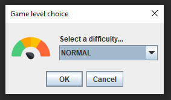
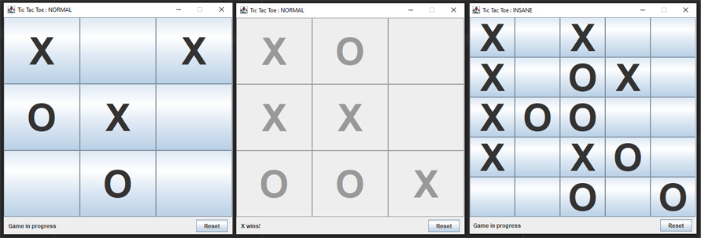

## The TicTacToe game with Java Swing

Do you want to play the Tic Tac Toe game :-) ?

[Rules of this game](https://en.wikipedia.org/wiki/Tic-tac-toe)

--- 

This is a project from a course in my JetBrain Academy study plan, where the
goal is to realize this game with the Java Swing API.

This project will be transformed later with more features.

> Here are the basic features for the moment.
> - You can choose a difficulty to have a challenge!
> - The game status is printed in real time.
> - There is a reset button to reset the game (but you always have the same difficulty).

### Before the game started

> It asks the player what level of difficulty they want to play at.

| Game level | Grid size | Total of cell |
|------------|:---------:|:-------------:|
| **NORMAL** |     3     |     **9**     |
| **HARD**   |     4     |    **16**     |
| **INSANE** |     5     |    **25**     |

---

After that, the game grid is built and the players can start playing.

### Example of rendering

### Futures ideas or functionalities

> - Have an AI to play with!
> - Add a setup window before the game starts.
> - Add a scoring system.
> - Add more tests
> - Add a menu bar at the top to give players more options.
> - Change the graphical interface for some elements

### And also
> - Adding more OOP concepts
> - Added automatic tests to fully test this program.

[Icon by FlatIcon](https://www.flaticon.com/free-icons/speedometer)
